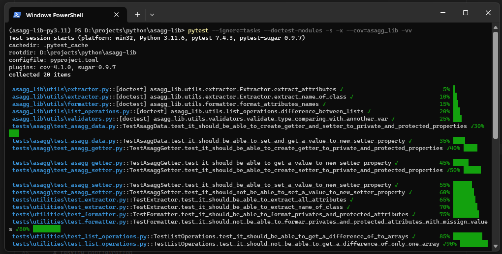
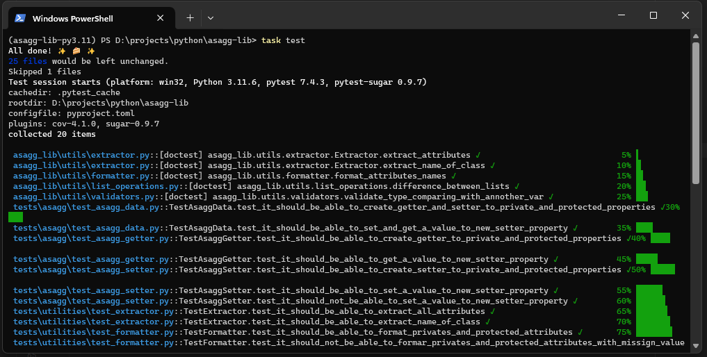
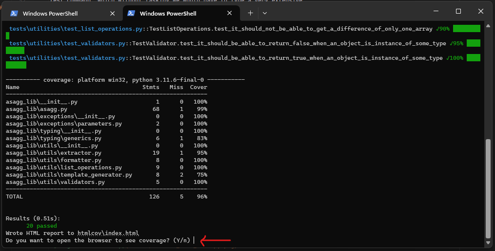
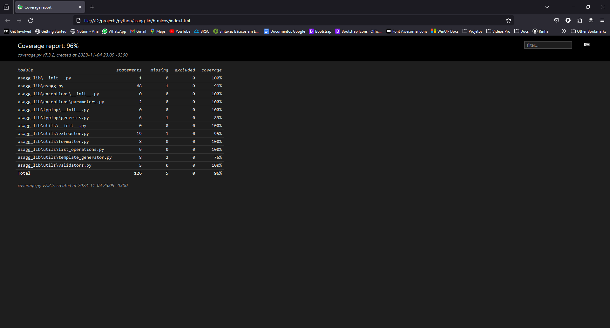

# Contribuition

To contribute to the project it is necessary to carry out a few steps before

## Environment Installation

### [Packager Manager](#packager_manager)
Firstly, let's start with installing the dependency manager, if you already have
[Poetry](https://python-poetry.org/) and [PipX](https://pypa.github.io/pipx/installation/) 
installed, you can skip this step:

#### Pipx
To install **Poetry**, it is recommended that you install it through **Pipx**, if you 
don't have **Pipx**, follow the environment documentation for your system and then come 
back here to continue...

Pipx documentation: [https://pypa.github.io/pipx/installation/](https://pypa.github.io/pipx/installation/)

#### Poetry
To install **Poetry** you need to run the following command:
```shell
# recommendation from Poetry
> pipx install poetry

# instalation with pip
> pip install poetry
```

If you want to perform some extra configuration, you can follow the 
[Poetry documentation](https://python-poetry.org/docs/#installation).

### Dependencies
Regarding dependencies, it's basic, run the following command:
```shell
> poetry install
```

## Introduction to the Project


### Tools
#### MKDocs
The **mkdocs** was used in the project to generate the documentation, it works based on markdown, 
where it reads the markdown's and then generates an HTML page with a menu structure, 
search field, theme switching, submenus and it is also possible to place some plugins to 
improve the documentation experience, all of this can be configured from a ``mkdocs.yml`` 
file in the root of the project. If you want to know more about the library, follow the 
link to the [MKDocs documentation](https://www.mkdocs.org/).

#### TaskPy
TaskiPy was used to be able to automate some commands such as the
test command, which without taskipy we would have to type a very extensive
command such as:
```shell
> pytest --ignore=tasks --doctest-modules -s -x --cov=asagg_lib -vv
```


Now with TaskiPy we only need a configuration in your project file (**``pyproject.toml``**),
to have a shortcut to be able to execute the same command above, example:
```toml
# pytest configuration
[tool.pytest.ini_options]
addopts = "--ignore=tasks --doctest-modules"

# taskipy configuration
[tool.taskipy.tasks]
test = "pytest -s -x --cov=asagg_lib -vv"
```

After the file is configured, you can execute the following command:
```shell
> task test
```



If you want to know more about TaskiPy, follow the 
[documentation](https://github.com/taskipy/taskipy).

#### PyTest
For the tests, **PyTest** was used to run the tests, and together pytest-sugar was used to 
have a more "pretty" output in the terminal. At the end of each test, a coverage of the 
application is generated to show how much we have covered of our code. Finally, if everything 
goes well, a script is executed that will open the coverage in your browser if you want.



If you type **'y'** a tab will open in your default browser with the project coverage.



If you want to know more about PyTest, follow the 
[documentation](https://docs.pytest.org).

## Project Structure
The library is divided into four folders, one containing all the application code, a 
folder for documentation, another for tasks that will be executed at some point to help 
the developer and one for testing the main module and utility functions.

```md
asagg-lib
├── asagg_lib
│   ├── exceptions
│   ├── templates
│   ├── typing
│   └── utils
├── docs
├── tasks
├── tests
│   ├── asagg
│   └── utilities
└── pyproject.toml
```
